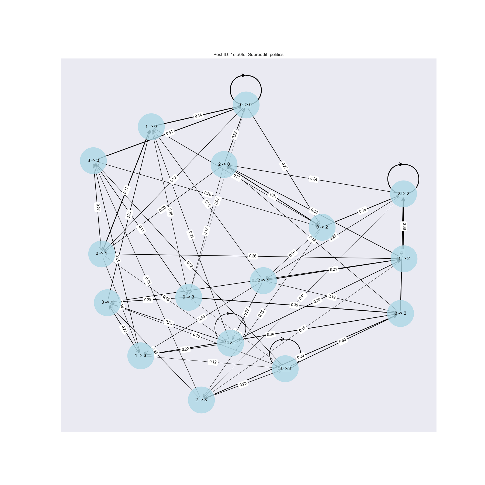
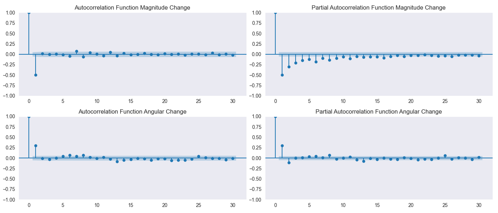
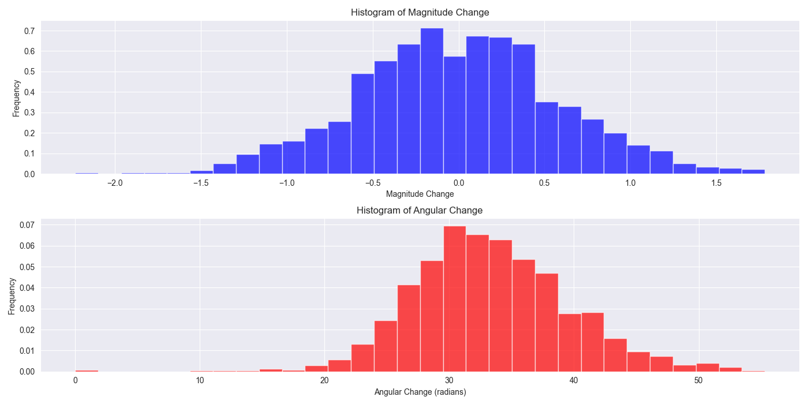
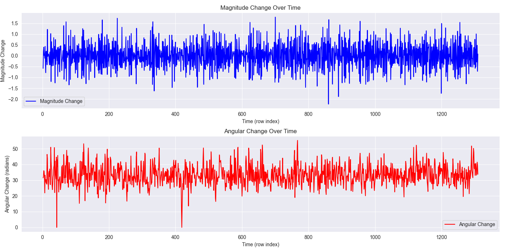

# Markov Model-Based Reddit Conversations Flow

This project explores the dynamics of online conversations on Reddit by applying techniques, including sentence embrdding, PCA, K-Means clustering, and Markov models. By reducing the dimensionality of comment embeddings and clustering them into discrete states, we model the transitions between these states using higher-order Markov processes. The project visualizes these state transitions through network graphs, offering a clear picture of conversational flow and dynamics over time.

## Usage
1. Clone the repository.
2. Run `pip3 install -r requirements.txt`.
3. Get your credentials from [Reddit](https://www.reddit.com/prefs/apps) and add them to `credentials.py`.
4. Edit `config.py`.
5. Run `python main.py`.

